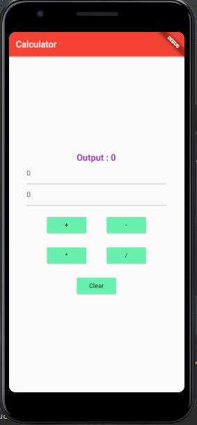
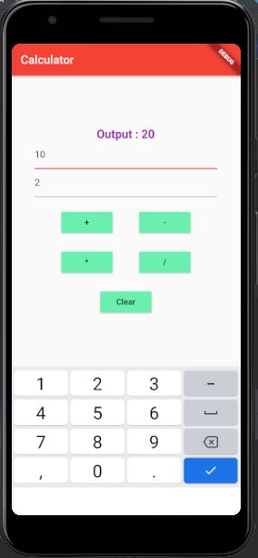

# Mobile-Cloud-Computing-Exercise

### Mô tả dự án

- Dự án này là bài tập nhập môn "Ứng dụng di động cho điện toán đám mây".

- Đề tài: Sử dụng Flutter làm ứng dụng máy tính bỏ túi đơn giản với 4 chức năng: Cộng, trừ, nhân, chia.

### Cách chạy ứng dụng

- Bước 1: Kéo dự án về máy.

- Bước 2: Mở dự án bằng Android Studio và đảm bảo rằng đã có thiết bị di động kết nối với máy hoặc sử dụng thiết bị di động ảo do AD hỗ trợ.

- Bước 3: Khởi động thiết bị di động và đợi tới khi dự án kết nối với thiết bị.

- Bước 4: Click chuột phải vào file `main.dart` trong folder `\lib` rồi chạy `Run`.

### Ảnh chạy chương trình

- Màn hình khi mới vào ứng dụng

- Màn hình khi nhấn vào ô nhập số

- Màn hình sau khi thực hiện phép tính

### Người thực hiện

- Họ và tên: Nguyễn Duy Diễn.

- Trường: Đại học Công Nghệ, Đại học Quốc gia Hà Nội.
